# 🦅 AI-Freelance-Hunter

<div align="center">


-brightgreen?style=for-the-badge&logo=pytest&logoColor=white)


<br/>

**Autonomous Real-Time Opportunity Hunting Engine for Junior Developers, Beginners & Final-Year Students (PFE)**  
*Orchestrated by **OpenClaw** · Continuous **2-Minute Docker Daemon** · **100% Free & Open-Source** · **Zero External Database (Pure Filesystem)** · **Instant Telegram Dispatch***

</div>

---

## 📌 Table of Contents (فهرس المحتويات)

1. [🎯 Core Mission & Strategy (الهدف الاستراتيجي للنظام)](#-core-mission--strategy-الهدف-الاستراتيجي-للنظام)
2. [💻 Target Engineering Fields & Technologies (المجالات التقنية المستهدفة)](#-target-engineering-fields--technologies-المجالات-التقنية-المستهدفة)
   - [Web Development (Full Stack / Frontend / Backend)](#1-web-development-full-stack--frontend--backend)
   - [AI & Autonomous Agents (RAG / LLMs)](#2-artificial-intelligence--autonomous-agents)
   - [Hybrid Web + AI SaaS](#3-hybrid-web--ai-highest-scoring)
   - [SQL & PL/SQL Database Engineering (Oracle / Procedures / Triggers)](#4-sql--plsql-database-engineering)
   - [Python Data Engineering & Analytics (Strict Python-Only / Zero R)](#5-python-data-engineering--analytics-strict-python-only)
3. [🌐 Multi-Platform Dynamic Scraping (مصادر البحث المتعددة الحية)](#-multi-platform-dynamic-scraping-مصادر-البحث-المتعددة-الحية)
4. [🗣️ Quality Controls: Language Filter & Non-Tech Disqualification](#️-quality-controls-language-filter--non-tech-disqualification)
5. [🔗 Live URL Reachability & Syntax Validator (التحقق اللحظي من الروابط)](#-live-url-reachability--syntax-validator-التحقق-اللحظي-من-الروابط)
6. [⚡ Real-Time Engine & Freshness Filter (النظام اللحظي وفلترة الحداثة)](#-real-time-engine--freshness-filter-النظام-اللحظي-وفلترة-الحداثة)
7. [📊 Complete Architectural Workflow Diagrams (مخططات سير العمل الشاملة)](#-complete-architectural-workflow-diagrams-مخططات-سير-العمل-الشاملة)
8. [🛡️ Multi-Key Deduplication & Pure Filesystem Persistence (التخزين ومنع التكرار)](#️-multi-key-deduplication--pure-filesystem-persistence-التخزين-ومنع-التكرار)
9. [📱 Instant Telegram Alerts (تنبيهات تيليغرام اللحظية المنسقة)](#-instant-telegram-alerts-تنبيهات-تيليغرام-اللحظية-المنسقة)
10. [🔄 Offline Recovery & Docker Daemon Health (التعافي التلقائي وصحة الدوكر)](#-offline-recovery--docker-daemon-health-التعافي-التلقائي-وصحة-الدوكر)
11. [⚙️ 100% Centralized Configuration via `.env` (الإعدادات الكاملة بدون أي هاردكود)](#️-100-centralized-configuration-via-env-الإعدادات-الكاملة-بدون-أي-هاردكود)
12. [🚀 Daily Usage & Command Reference (دليل الاستعمال اليومي)](#-daily-usage--command-reference-دليل-الاستعمال-اليومي)
13. [📂 Repository Structure (هيكلية المشروع الكاملة)](#-repository-structure-هيكلية-المشروع-الكاملة)

---

## 🎯 Core Mission & Strategy (الهدف الاستراتيجي للنظام)

**AI-Freelance-Hunter** is **NOT** a generic bulk job scraper. It is a **personal autonomous opportunity hunting system** designed specifically to find the **maximum practical number of opportunities that a junior developer, beginner, or final-year engineering student (PFE) can realistically land**.

### Strategic Priorities (الأولويات الاستراتيجية):
* 🥇 **Freelance Projects & Gigs** : Independent contracts, direct client missions, fixed-price and hourly projects.
* 🥇 **Remote Opportunities (Tunisia & Worldwide Remote)** : Global international remote work and Tunisian local client missions.
* 🥇 **Entry-Level & Junior Jobs** : Positions explicitly welcoming juniors, beginners, graduates, or candidates with 0–2 years of experience.
* 🥇 **Startups & SMEs / PMEs** : Agile small tech teams, digital software agencies, and fast-moving startups.
* 🥇 **Final-Year Internships (PFE)** : High-value graduation projects in Full Stack Web, AI/RAG, and Database/Data systems.
* 🚫 **Strict Reality Check** : Zero mock data, zero fake notifications, zero dead links (404/410), zero foreign language posts (French & English only), and zero non-tech positions.

---

## 💻 Target Engineering Fields & Technologies (المجالات التقنية المستهدفة)

Every scanned listing is evaluated and parsed through our deterministic classification engine against target engineering fields:

### 1. Web Development (Full Stack / Frontend / Backend)
* **Frontend** : React, Next.js, TypeScript, JavaScript, Tailwind CSS, Redux, HTML5/CSS3.
* **Backend** : Node.js, Express, RESTful APIs, GraphQL, NestJS.
* **Stacks** : MERN Stack (MongoDB, Express, React, Node), Full-Stack TypeScript.
* **Target Roles** : Full Stack Developer, Junior React Developer, Next.js Engineer, Web Developer.

### 2. Artificial Intelligence & Autonomous Agents
* **Core Tech** : RAG (Retrieval-Augmented Generation), LLMs (Large Language Models), Prompt Engineering, Fine-Tuning.
* **Autonomous AI Agents** : Multi-agent systems, Tool-calling agents, Autonomous workflow automations.
* **Frameworks & APIs** : LangChain, LlamaIndex, OpenAI API, HuggingFace, Anthropic Claude, Google Gemini.
* **Vector Databases** : Pinecone, ChromaDB, Qdrant, Weaviate, pgvector.
* **Target Roles** : AI Engineer, Generative AI Developer, LLM/RAG Developer, AI Agent Engineer, Chatbot Specialist.

### 3. Hybrid Web + AI (Highest Scoring)
* AI SaaS products, interactive web platforms integrating AI models, full-stack RAG web applications with modern React/Next.js frontends and Node/Python backends.
* **Scoring Impact** : Triggers the `Hybrid Web+AI` bonus (**+20 points**).

### 4. SQL & PL/SQL Database Engineering
* **Core Tech** : SQL, PL/SQL, Oracle Database (11g, 12c, 19c, 21c, XE).
* **Database Programming** : Stored Procedures, Packages, Triggers, Functions, Views, Materialized Views.
* **Performance & Architecture** : Query Optimization, Indexing, Execution Plans, Data Integrity, Relational Database Design (PostgreSQL, MySQL, Oracle).
* **Target Roles** : PL/SQL Developer, PL/SQL Engineer, Junior SQL Developer, SQL Engineer, Oracle Developer, Database Engineer.
* **Scoring Impact** : Triggers the `SQL/PLSQL` bonus (**+15 points**).

### 5. Python Data Engineering & Analytics (Strict Python-Only)
* **Core Tech** : Python 3, Pandas, NumPy, PySpark, Apache Airflow, FastAPI, Flask, SQLAlchemy.
* **Data Processing** : ETL Pipelines, Data Extraction, Web Scraping, Data Cleaning, Automated Reporting.
* **Target Roles** : Python Data Engineer, Python Data Analyst, ETL Developer, Data Pipeline Engineer.
* **Scoring Impact** : Triggers the `Python Data` bonus (**+20 points**).
* ⚠️ **STRICT PYTHON-ONLY RULE (R is Forbidden)** :
  * Python is the mandatory data language.
  * Any role requiring R as a primary language (e.g. *"R Data Analyst"*, *"R Programmer"*, *"R Data Engineer"*, *"R required"*) is **STRICTLY DISQUALIFIED** (`Score = 0`, Status = `disqualified`, Category = `Ignore`).
  * If a listing is for a Data Analyst or Data Engineer and mentions R without Python, it is instantly disqualified.
  * Only listings where Python is primary and R is explicitly mentioned as optional/nice-to-have (*"Python required, R is a plus"*) are accepted.

---

## 🌐 Multi-Platform Dynamic Scraping (مصادر البحث المتعددة الحية)

The system aggregates multiple diverse channels using modular, failure-isolated scrapers:

```text
┌────────────────────────────────────────────────────────────────────────────────────────┐
│                              AI-Freelance-Hunter Sources                               │
├─────────────────────┬─────────────────────┬─────────────────────┬──────────────────────┤
│ Live Web Search     │ Public REST APIs    │ Public RSS Feeds    │ Facebook Groups      │
├─────────────────────┼─────────────────────┼─────────────────────┼──────────────────────┤
│ • Google News / RSS │ • RemoteOK API      │ • WeWorkRemotely    │ • Freelance Tunisie  │
│   (Tunisia + World) │ • Remotive API      │ • Jobspresso Remote │ • Développeurs TN    │
│ • Real-time queries │ • Arbeitnow API     │ • Hacker News Jobs  │ • IT & PFE Groups    │
│   (Web, AI, PL/SQL, │ • Jobicy Remote API │ • Dynamic RSS Seeds │ • Contact extraction │
│    Python Data)     │                     │                     │   (Phone, WhatsApp)  │
└─────────────────────┴─────────────────────┴─────────────────────┴──────────────────────┘
```

### 🔍 Live Web Search Adapter (`src/adapters/web_search_adapter.py`)
* Executes open-web queries for Tunisian tech opportunities and worldwide remote gigs via public RSS endpoints.
* Actively scrapes for:
  - *Freelance & Web Junior*: `freelance developpeur react tunisie`, `stage pfe developpeur full stack tunisie`, `junior full stack developer remote freelance`.
  - *AI & Agents*: `junior ai agent engineer remote`, `remote junior react python developer`.
  - *PL/SQL & SQL*: `junior pl/sql developer remote`, `sql developer junior remote freelance`, `pl/sql engineer remote freelance`, `developpeur pl/sql oracle tunisie`.
  - *Python Data*: `junior python data engineer remote`, `python data analyst junior remote`, `data engineer python sql junior freelance`.
* Fully configurable via `.env` (`WEB_SEARCH_QUERIES`, `WEB_SEARCH_MAX_QUERIES`, `WEB_SEARCH_MAX_ITEMS_PER_QUERY`).

### ⚡ Public REST APIs (`src/adapters/api_adapter.py`)
* Real-time consumption of public JSON APIs:
  * **Jobicy Remote API** (`https://jobicy.com/api/v2/remote-jobs`)
  * **RemoteOK API** (`https://remoteok.com/api`)
  * **Remotive API** (`https://remotive.com/api/remote-jobs`)
  * **Arbeitnow API** (`https://www.arbeitnow.com/api/job-board-api`)

### 📰 Public RSS Feeds (`src/adapters/rss_adapter.py`)
* Continuous monitoring of **WeWorkRemotely**, **Jobspresso**, and **HackerNews Freelance (*Who is Hiring*)**.
* Detail page fetcher (`fetch_details`) enriches brief summaries with full descriptions and direct apply links.

### 👥 Facebook Groups Adapter (`src/adapters/facebook_adapter.py`)
* Scrapes public Tunisian freelance communities (`freelance.tunisie.it`, `developpeurs.tunisie`).
* **Direct Contact Extraction** :
  * 📞 Phone numbers (`+216 XX XXX XXX`, `98XXXXXX`, `2XXXXXXX`, `5XXXXXXX`).
  * 💬 WhatsApp direct links (`wa.me/216...`).
  * 📧 Direct client emails (`contact@...`, `@gmail.com`).
* **Failure Isolation** : If Facebook triggers an authentication barrier or rate limit, the adapter logs gracefully and never interrupts other sources.

---

## 🗣️ Quality Controls: Language Filter & Non-Tech Disqualification

### 1. French & English Language Filter (`src/classifier/language_detector.py`)
* Zero-dependency deterministic linguistic analyzer detecting `en`, `fr`, `de`, `es`, `it`.
* **Strict Enforcement** : Spanish, German, Italian, or other language listings are **disqualified** (`Score = 0`, Category = `Ignore`, Status = `disqualified`).
* Controlled via `.env`:
  ```env
  ALLOWED_LANGUAGES=en,fr
  REJECT_OTHER_LANGUAGES=true
  ```

### 2. Non-Tech Role Disqualification (`src/classifier/rule_detector.py`)
* Non-engineering roles (Account Executive, Sales, Marketing, Recruiter, HR, Finance, Legal, etc.) are automatically detected and **disqualified** with `Score = 0`.
* Prevents sales and business positions posted by tech companies from polluting developer alerts.

---

## 🔗 Live URL Reachability & Syntax Validator (التحقق اللحظي من الروابط)

Broken links and 404 pages waste valuable time. AI-Freelance-Hunter enforces strict URL verification:

### 1. Syntax Sanitization & Tracking Stripper
* Normalizes URLs and removes tracking noise (`utm_*`, `fbclid`, `gclid`, `ref`, `source`, `campaign`).
* Strips fragment `#` to provide direct, clean application links.

### 2. Asynchronous Live Reachability Check (`src/utils/url_validator.py`)
* Dispatches lightweight asynchronous HTTP `HEAD` (falling back to `GET`) requests.
* Verifies status `200..399` (and Cloudflare challenges `403`).
* Discards dead links returning `404 Not Found`, `410 Gone`, or DNS failures.
* In-memory cache with configurable TTL (`URL_CACHE_TTL_SECONDS=3600.0`) to avoid duplicate network requests.

### 3. Telegram Pre-Flight Check (`src/notifier/telegram.py`)
* Re-validates URL reachability immediately before queueing and dispatching any Telegram notification. If a link died between crawling and alert delivery, the alert is discarded.

---

## ⚡ Real-Time Engine & Freshness Filter (النظام اللحظي وفلترة الحداثة)

### ⏱️ Continuous Real-Time Cadence (كل دقيقتين)
* Operates on a continuous **2-minute polling loop** (`CRAWL_INTERVAL_MINUTES=2`).
* Newly dropped opportunities (even 1 minute old) are captured, scored, and alerted immediately.

### 🚫 Strict 24-Hour Expiration Filter ("ما يجيبش حاجة قديمة")
* Opportunities older than 24 hours (`FRESHNESS_MAX_AGE_HOURS=24.0`) receive a **-60 point penalty** and are strictly suppressed below 60 (`Ignore`). Old posts never trigger Telegram alerts.

### 🧠 Multilingual Date Parser (`src/classifier/date_parser.py`)
* **Arabic / Tunisian** : `"توّا"`, `"منذ 5 دقائق"`, `"قبل ساعة"`, `"البارح"`.
* **French** : `"à l'instant"`, `"il y a 2 minutes"`, `"il y a 1 heure"`, `"hier"`.
* **English** : `"just now"`, `"5m ago"`, `"1 hour ago"`, `"today"`.
* **Standard Formats** : RFC 2822 RSS `pubDate`, ISO 8601, Unix epoch timestamps.

### 🚀 Ultra-Fresh Real-Time Bonus (+15 Points)
* Brand-new opportunities (< 2 hours old) receive a **+15 bonus score**, ensuring high priority.

---

## 📊 Complete Architectural Workflow Diagrams (مخططات سير العمل الشاملة)

### Diagram 1: End-to-End Opportunity Processing Pipeline

```mermaid
flowchart TD
    subgraph SOURCING ["1. Multi-Platform Live Sourcing"]
        WEB["Dynamic Web Search<br/>(Google News RSS)<br/>Web, AI, PL/SQL, Data"]
        API["Public REST APIs<br/>(Jobicy, RemoteOK,<br/>Remotive, Arbeitnow)"]
        RSS["Public RSS Feeds<br/>(WeWorkRemotely, Jobspresso,<br/>HackerNews Jobs)"]
        FB["Facebook Public Groups<br/>(Tunisia IT & Freelance)<br/>Phone / WhatsApp / Email"]
        DISC["Dynamic Discovery<br/>(Auto-evaluates healthy seeds)"]
    end

    subgraph QUALITY ["2. Ingestion & Pre-Flight Quality Guardrails"]
        ADAPTERS["BaseSourceAdapter (HTTPX / BeautifulSoup)<br/>Failure Isolation & Rate-Limiting"]
        URL_CLEAN["URL Validator: Clean Tracking<br/>Strip utm_*, fbclid, gclid, ref"]
        LANG_CHECK{"Language Check<br/>French or English?<br/>(ALLOWED_LANGUAGES)"}
        DISQ_LANG["Disqualify (Score = 0)<br/>German, Spanish, etc."]
        NON_TECH{"Role Check<br/>Developer / AI / Data / SQL?"}
        DISQ_ROLE["Disqualify Non-Tech (Score = 0)<br/>Sales, HR, Marketing"]
        R_CHECK{"Strict Data Rule:<br/>Uses R without Python?<br/>R-only Data Role?"}
        DISQ_R["Disqualify R (Score = 0)<br/>Python is Mandatory"]
        DATE_CHECK{"Freshness Check<br/>Age <= 24 Hours?<br/>(DateParser)"}
        DISCARD_OLD["Discard Outdated Post<br/>(-60 pts, Score < 60, Ignore)"]
    end

    subgraph SCORING ["3. Deterministic Scoring Engine (0–100)"]
        TECH_DETECT["TechDetector & RuleDetector<br/>React, Next, Node, AI/RAG, PL/SQL, SQL, Python Data"]
        SCORE_CALC["Calculate Final Score<br/>+25 AI | +20 Web | +20 Hybrid | +20 Python Data | +15 SQL/PLSQL<br/>+20 Junior | +15 Remote | +15 Freelance | +15 Fresh (< 2h)<br/>-30 Senior Penalty | -35 Expert Penalty"]
    end

    subgraph STORAGE ["4. Multi-Key Deduplication & Zero-DB Storage"]
        DEDUP{"Deduplication Check<br/>Clean URL / Canonical URL / SHA-256"}
        SKIP_DUP["Skip Duplicate (Zero Duplication)"]
        ATOMIC_WRITE["AtomicFS (FileLock + portalocker)<br/>Thread-Safe / Process-Safe Persistence"]
        FILES[("data/opportunities.jsonl<br/>data/seen_urls.json<br/>data/fingerprints.json")]
    end

    subgraph DISPATCH ["5. Live Reachability & Telegram Alert"]
        SCORE_THRESH{"Score >= 75?<br/>(Strong / Excellent)"}
        LIVE_URL{"Live URL Check<br/>HTTP HEAD/GET 200..399 online?"}
        DROP_DEAD["Drop Alert (Dead Link 404/410)"]
        QUEUE["Persistent Queue<br/>data/notifications.json"]
        TELEGRAM["Telegram Dispatcher<br/>⚡ NOUVEAU (EN DIRECT) Badge<br/>Direct Client Contacts"]
    end

    subgraph DAEMON ["6. Autonomous Daemon & Resilience"]
        DOCKER["Continuous Docker Daemon (2m cycle)<br/>restart: unless-stopped"]
        HEALTH["Healthcheck (src/healthcheck.py)<br/>Status: Up (healthy)"]
        RECOVER["RecoveryManager (src/recovery/manager.py)<br/>Recovers missed offline window (up to 72h)"]
    end

    WEB --> ADAPTERS
    API --> ADAPTERS
    RSS --> ADAPTERS
    FB --> ADAPTERS
    DISC --> ADAPTERS

    ADAPTERS --> URL_CLEAN
    URL_CLEAN --> LANG_CHECK

    LANG_CHECK -- "No (Other)" --> DISQ_LANG
    LANG_CHECK -- "Yes (fr / en)" --> NON_TECH

    NON_TECH -- "Non-Tech" --> DISQ_ROLE
    NON_TECH -- "Tech Role" --> R_CHECK

    R_CHECK -- "R Primary / No Python" --> DISQ_R
    R_CHECK -- "Python / Clean" --> DATE_CHECK

    DATE_CHECK -- "No (> 24h)" --> DISCARD_OLD
    DATE_CHECK -- "Yes (<= 24h)" --> TECH_DETECT

    TECH_DETECT --> SCORE_CALC
    SCORE_CALC --> DEDUP

    DEDUP -- "Already Seen" --> SKIP_DUP
    DEDUP -- "New Fresh Post" --> ATOMIC_WRITE
    ATOMIC_WRITE --> FILES

    ATOMIC_WRITE --> SCORE_THRESH
    SCORE_THRESH -- "Score >= 75" --> LIVE_URL
    LIVE_URL -- "Dead Link (404/410)" --> DROP_DEAD
    LIVE_URL -- "Online Reachable" --> QUEUE
    QUEUE --> TELEGRAM

    DOCKER --> HEALTH
    DOCKER --> RECOVER
    RECOVER -.-> "Backfill missed window" .-> ADAPTERS
```

### Diagram 2: Scoring Decision Matrix

```mermaid
graph LR
    subgraph BONUSES ["Score Bonuses (0–100)"]
        B1["AI / RAG / Agents (+25)"]
        B2["Full Stack Web (+20)"]
        B3["Hybrid Web + AI (+20)"]
        B4["Python Data (+20)"]
        B5["SQL / PLSQL (+15)"]
        B6["Junior / Beginner (+20)"]
        B7["Remote Role (+15)"]
        B8["Freelance / Gig (+15)"]
        B9["Ultra-Fresh < 2h (+15)"]
    end

    subgraph PENALTIES ["Penalties & Disqualifications"]
        P1["Senior Only (-30)"]
        P2["Expert Only (-35)"]
        P3["Expired > 24h (-60 / Capped < 60)"]
        D1["Language not fr/en (Score = 0)"]
        D2["Non-Tech Role (Score = 0)"]
        D3["R without Python (Score = 0)"]
        D4["Dead / Broken URL (Score = 0)"]
    end

    subgraph OUTCOMES ["Classification Categories"]
        C1["90–100: Excellent (Telegram Alert)"]
        C2["75–89: Strong (Telegram Alert)"]
        C3["60–74: Relevant (Saved in File)"]
        C4["< 60: Ignore (Discarded)"]
    end

    BONUSES --> OUTCOMES
    PENALTIES --> OUTCOMES
```



---

## 🛡️ Multi-Key Deduplication & Pure Filesystem Persistence (التخزين ومنع التكرار)

### Zero Database Philosophy (بدون أي قاعدة بيانات خارجية)
* **Zero Database Engines** : No PostgreSQL, MySQL, MongoDB, Redis, or SQLite required.
* All data is stored in portable, transparent JSON and JSONL files in `data/`.
* **Atomic File Operations** : Managed via `AtomicFS` with multi-platform file locking (`portalocker` + `FileLock`), preventing process race conditions and write corruption.

### 4-Stage Deduplication Key (`src/storage/deduplicator.py`)
An opportunity is flagged as a duplicate and ignored if ANY of these match:
1. **Clean URL** (tracking parameters stripped).
2. **Canonical URL**.
3. **Company + Title Slug**.
4. **SHA-256 Content Fingerprint** generated from normalized title, company, and description.

---

## 📱 Instant Telegram Alerts (تنبيهات تيليغرام اللحظية المنسقة)

When an opportunity matches target domains with `Score >= 75` and passes live URL reachability, a formatted alert is dispatched immediately to Telegram:

```html
⚡ <b>NOUVELLE OPPORTUNITÉ (EN DIRECT)</b>

<b>Junior PL/SQL Engineer - Oracle & SQL</b>
🏢 <b>Telecom TN</b>
⏱️ <b>Publié :</b> À l'instant (En direct)
🎯 <b>Score :</b> 95/100
💼 Freelance / Contract
🌍 Remote (Worldwide)
👨💻 Junior-friendly

💻 <b>Database :</b> PL/SQL, Oracle, SQL, Stored Procedures
📌 <b>Source :</b> jobicy_remote
🔗 <a href="https://...">Postuler / Voir l'offre</a>
```

If a Facebook post contains direct client contacts, they are clearly displayed:
```html
📞 <b>Tél :</b> +216 22 123 456 | 💬 <b>WhatsApp :</b> wa.me/21622123456 | 📧 <b>Email :</b> client@agency.tn
```

* **Zero Alert Loss** : If your internet connection drops, alerts remain safely in `data/notifications.json` (`pending`) and dispatch automatically upon reconnection.
* **Zero Duplication** : Sent notification IDs are permanently registered in `data/notifications.json` (`sent`).

---

## 🔄 Offline Recovery & Docker Daemon Health (التعافي التلقائي وصحة الدوكر)

### 🔌 Downtime Detection & Catch-Up Crawl
1. At startup, `RecoveryManager` calculates the time elapsed since the previous heartbeat (`hours_offline`).
2. If offline for longer than `DOWNTIME_THRESHOLD_MINUTES` (15m), it initiates a **Recovery Crawl** backfilling up to `MAX_MISSED_WINDOW_HOURS` (72h).
3. Deduplication guarantees that **only new opportunities** published during the offline window are added and alerted.

### 🐳 Docker Healthcheck
* Integrated health check script (`src/healthcheck.py`):
  * Verifies data directory accessibility and JSON integrity.
  * Verifies active crawler daemon heartbeat.
* Status confirmed : **`Up (healthy)`**.

---

## ⚙️ 100% Centralized Configuration via `.env` (الإعدادات الكاملة بدون أي هاردكود)

**Zero Hardcoding** : All settings, thresholds, queries, limits, and timeouts are centralized in [`.env`](file:///c:/full_stack%20projects/AI-Freelance-Hunter/.env):

| Environment Variable | Default Value | Description |
|----------------------|---------------|-------------|
| `TELEGRAM_BOT_TOKEN` | `""` | Telegram Bot Token from @BotFather |
| `TELEGRAM_CHAT_ID` | `""` | Telegram Chat ID from @userinfobot |
| `MIN_NOTIFICATION_SCORE` | `75` | Minimum score (0–100) to trigger Telegram alert |
| `TELEGRAM_RATE_LIMIT_DELAY` | `2.0` | Delay (seconds) between consecutive Telegram alerts |
| `TELEGRAM_TIMEOUT_SECONDS` | `15` | Network timeout for Telegram API requests |
| `TELEGRAM_MAX_RETRIES` | `5` | Maximum retry attempts for failed Telegram alerts |
| `CRAWL_INTERVAL_MINUTES` | `2` | Interval between hunting cycles (**2m = Real-Time**) |
| `JITTER_SECONDS` | `15` | Random jitter to avoid synchronized scraping blocks |
| `REALTIME_MODE` | `true` | Enables real-time evaluation and instant alerting |
| `FRESHNESS_MAX_AGE_HOURS` | `24.0` | **Maximum post age** (posts > 24h are discarded) |
| `FRESHNESS_REJECT_EXPIRED` | `true` | Suppresses outdated opportunities from alerts |
| `FRESHNESS_REALTIME_WINDOW_HOURS` | `2.0` | Window considered ultra-fresh (< 2h) |
| `FRESHNESS_REALTIME_BONUS_POINTS` | `15` | Score bonus awarded to ultra-fresh posts |
| `ALLOWED_LANGUAGES` | `en,fr` | **Allowed languages** (French & English only) |
| `REJECT_OTHER_LANGUAGES` | `true` | Disqualifies postings in German, Spanish, etc. |
| `VALIDATE_URLS_ONLINE` | `true` | Checks live HTTP reachability (HEAD/GET) of URLs |
| `URL_VALIDATION_TIMEOUT_SECONDS` | `5.0` | Timeout for live URL reachability checks |
| `URL_CACHE_TTL_SECONDS` | `3600.0` | Cache duration (seconds) for verified URLs |
| `REJECT_INVALID_URLS` | `true` | Discards postings with dead (404/410) or broken URLs |
| `WEB_SEARCH_QUERIES` | `...` | Semicolon-separated queries for open-web search |
| `WEB_SEARCH_MAX_QUERIES` | `6` | Max web search queries executed per cycle |
| `WEB_SEARCH_MAX_ITEMS_PER_QUERY` | `8` | Max items extracted per web search query |
| `DOWNTIME_THRESHOLD_MINUTES` | `15` | Downtime duration triggering recovery crawl |
| `MAX_MISSED_WINDOW_HOURS` | `72` | Maximum historical recovery crawl window |
| `LOG_LEVEL` | `INFO` | Logging level (`DEBUG`, `INFO`, `WARNING`, `ERROR`) |
| `DATA_DIR` | `data` | Root persistence directory for filesystem storage |
| `NETWORK_TIMEOUT_SECONDS` | `20` | Scraper HTTP timeout |
| `NETWORK_USER_AGENT` | Browser UA | Browser User-Agent header |
| `BONUS_AI` | `25` | Score bonus for AI / RAG / LLM skills |
| `BONUS_WEB` | `20` | Score bonus for Full-Stack / React / Node skills |
| `BONUS_HYBRID` | `20` | Score bonus for Hybrid Web + AI projects |
| `BONUS_PYTHON_DATA` | `20` | Score bonus for Python Data Engineer & Analyst |
| `BONUS_SQL_PLSQL` | `15` | Score bonus for SQL, PL/SQL & Oracle |
| `BONUS_JUNIOR` | `20` | Score bonus for junior-friendly signals |
| `BONUS_REMOTE` | `15` | Score bonus for remote roles |
| `BONUS_FREELANCE` | `15` | Score bonus for freelance / contract missions |
| `PENALTY_SENIOR` | `-30` | Penalty for senior-only listings (capped < 60) |
| `PENALTY_UNRELATED` | `-50` | Penalty for non-tech roles (Sales, HR, etc.) |
| `PENALTY_R_ONLY` | `-50` | Penalty for R (Disqualified to 0) |

---

## 🚀 Daily Usage & Command Reference (دليل الاستعمال اليومي)

### Option A: 24/7 Autonomous Docker Daemon (Recommended)

#### 1. Configure `.env`
Set your Telegram Bot credentials in `.env`:
```env
TELEGRAM_BOT_TOKEN=your_telegram_bot_token_here
TELEGRAM_CHAT_ID=your_telegram_chat_id_here
ALLOWED_LANGUAGES=en,fr
MIN_NOTIFICATION_SCORE=75
CRAWL_INTERVAL_MINUTES=2

```

#### 2. Start the Daemon in Background
```bash
docker compose up -d --build
```

#### 3. Monitor Health Status & Live Logs
```bash
# Check container status (should display 'Up (healthy)')
docker compose ps

# Follow live real-time crawling logs
docker compose logs -f --tail 40
```

#### 4. Stop the Daemon
```bash
docker compose down
```

---

### Option B: Local Python CLI Commands

```bash
# 1. Run a single hunting cycle
python -m src.main run

# 2. Start the continuous 2-minute autonomous daemon locally
python -m src.main daemon

# 3. Test connectivity and health of all scrapers
python -m src.main test-sources

# 4. Display database statistics and top-scored opportunities
python -m src.main stats

# 5. Force recovery crawl
python -m src.main recover
```

### Running the Automated Test Suite
```bash
python -m pytest tests/ -v
```
All **62/62 tests pass (100% green)** covering classification, PL/SQL engineering, SQL developer, Python data engineering, Python data analyst, strict R disqualification, language filtering, URL live validation, deduplication, Facebook scraping, date parsing, freshness, recovery, scoring, and configuration overrides.

---

## 📂 Repository Structure (هيكلية المشروع الكاملة)

```text
AI-Freelance-Hunter/
├── .env                          # Centralized configuration (User credentials & parameters)
├── .env.example                  # Fully documented environment template
├── docker-compose.yml            # Docker container deployment with persistent volumes
├── Dockerfile                    # Python 3.12-slim container definition with healthcheck
├── requirements.txt              # Open-source dependencies (httpx, bs4, lxml, pydantic...)
├── README.md                     # Comprehensive documentation & architecture guide
│
├── config/                       # Domain YAML rules (overridden by .env)
│   ├── filters.yaml              # Junior signals, language, URL validation, non-tech signals
│   ├── profile.yaml              # Candidate profile & target engineering fields
│   ├── roles.yaml                # Web, AI, Hybrid, Python Data, SQL/PLSQL domain definitions
│   ├── schedules.yaml            # Crawl intervals & jitter
│   ├── scoring.yaml              # Score bonuses, penalties, and threshold ranges
│   ├── search_queries.yaml       # Bilingual query templates & predefined queries
│   ├── sources.yaml              # Registry of RSS, API, Facebook, and Web Search sources
│   ├── system.yaml               # Storage paths and network defaults
│   └── technologies.yaml         # Tech aliases and strict R rejection rules
│
├── src/                          # Core Modular Source Code
│   ├── __init__.py
│   ├── main.py                   # CLI entrypoint (run, daemon, stats, test-sources, recover)
│   ├── config_loader.py          # Centralized typed configuration loader (.env > YAML)
│   ├── healthcheck.py            # Docker healthcheck script
│   ├── models.py                 # NormalizedOpportunity schema (Pydantic)
│   │
│   ├── adapters/                 # Modular Scrapers & Fetchers
│   │   ├── base.py               # Abstract adapter base class with failure isolation
│   │   ├── api_adapter.py        # REST API adapter (RemoteOK, Remotive, Arbeitnow, Jobicy)
│   │   ├── rss_adapter.py        # RSS/Atom adapter with detail page fetcher
│   │   ├── facebook_adapter.py   # Facebook public groups adapter with contact extraction
│   │   ├── web_search_adapter.py # Dynamic open-web search adapter (Google News RSS)
│   │   └── discovery.py          # Adapter factory & dynamic source discovery engine
│   │
│   ├── classifier/               # Intelligent Evaluation Engine
│   │   ├── engine.py             # 11-step normalization & classification pipeline
│   │   ├── language_detector.py  # Bilingual French/English detector & filter
│   │   ├── date_parser.py        # Multilingual relative date parser & freshness evaluator
│   │   ├── rule_detector.py      # Junior/senior/remote/freelance & role detector
│   │   ├── tech_detector.py      # Tech stack matching & strict R rejection
│   │   └── scoring.py            # Normalized 0–100 scoring engine with real-time bonus
│   │
│   ├── storage/                  # Zero-DB Atomic Persistence
│   │   ├── atomic_fs.py          # Thread-safe & process-safe FileLock operations
│   │   ├── deduplicator.py       # Multi-key deduplication (URL, Canonical, Fingerprint)
│   │   └── repository.py         # JSON/JSONL filesystem storage manager
│   │
│   ├── notifier/                 # Real-Time Alert Engine
│   │   ├── queue.py              # Persistent notification queue (data/notifications.json)
│   │   └── telegram.py           # Telegram dispatcher with pre-flight check & badges
│   │
│   ├── orchestration/            # OpenClaw Pipeline & Scheduler
│   │   ├── openclaw_pipeline.py  # Master hunting pipeline & recovery workflow
│   │   └── scheduler.py          # Continuous daemon scheduler with graceful shutdown
│   │
│   └── recovery/                 # Offline Recovery Engine
│       └── manager.py            # Downtime calculation & missed-window backfill
│
├── data/                         # Persistent Filesystem Data (Mounted in Docker)
│   ├── opportunities.jsonl       # Stored opportunities with full details
│   ├── seen_urls.json            # Deduplication URL registry
│   ├── fingerprints.json         # SHA-256 content fingerprints
│   ├── notifications.json        # Notification queue (pending, sent, failed)
│   ├── crawl_state.json          # Current crawl execution status
│   └── recovery_state.json       # Heartbeat & shutdown history
│
└── tests/                        # Automated Test Suite (62/62 Passed - 100% Green)
    ├── test_classification.py    # Tech, junior, senior, PL/SQL, SQL, Python Data, R tests
    ├── test_language_filter.py   # French/English language detection and filter tests
    ├── test_url_validation.py    # URL cleaning and live reachability tests
    ├── test_config.py            # .env override and typed ConfigLoader tests
    ├── test_deduplication.py     # URL normalization, fingerprint, and locking tests
    ├── test_facebook.py          # Contact extraction and Facebook scraper tests
    ├── test_freshness.py         # Date parser, relative times, and 24h filter tests
    ├── test_recovery.py          # Downtime detection and recovery tests
    ├── test_scoring.py           # Bonus weights, thresholds, and penalty tests
    ├── test_sources.py           # Failure isolation and source health tests
    ├── test_telegram.py          # Message formatting and persistent queue tests
    └── test_e2e.py               # Complete end-to-end pipeline test
```

---

## 📜 License & Open Source Integrity

This project is built strictly with **100% Free & Open-Source Software (FOSS)**:
* Python 3.12 / 3.14
* HTTPX, BeautifulSoup4, Lxml, Pydantic, PyYAML, Portalocker, FileLock
* **Zero proprietary APIs or paid databases required.**
