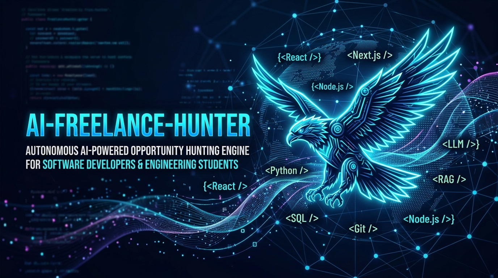
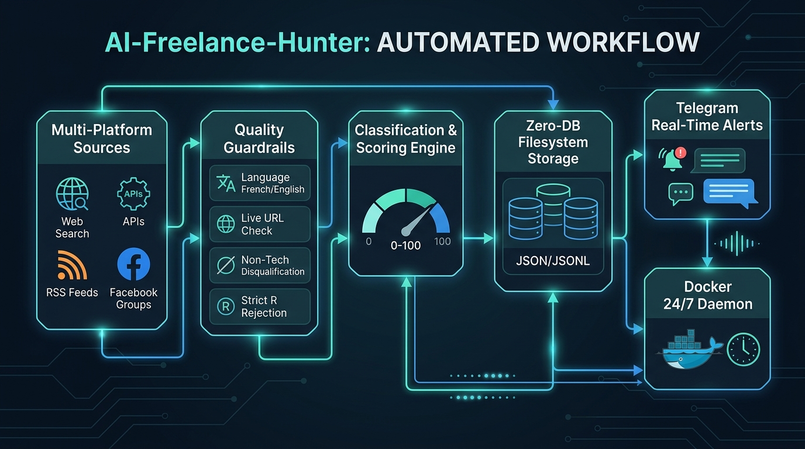

# 🦅 AI-Freelance-Hunter

<div align="center">



<br/>

[](https://www.python.org/)
[](https://www.docker.com/)
[](https://telegram.org/)
[](https://www.python-httpx.org/)
[](https://www.crummy.com/software/BeautifulSoup/)
[](https://docs.pydantic.dev/)
[-brightgreen?style=for-the-badge&logo=pytest&logoColor=white)](#-tests--qualit%C3%A9-du-code)
[](LICENSE)

<br/>

**Chasseur Autonome d'Opportunités Tech en Temps Réel pour Débutants, Juniors & Étudiants en PFE**  
*صياد الفرص البرمجية الذكي واللحظي للمبتدئين، المتخرجين الجدد والطلبة في تونس وعالمياً*  
*Propulsé par **OpenClaw** · Daemon **Docker 24/7** · **100% Gratuit & Open-Source** · **Sans Base de Données Externe** · **Alertes Telegram Instantanées***

</div>

---

## 🌟 En Bref : C'est Quoi AI-Freelance-Hunter ? (دليل مبسط للمبتدئين)

Vous cherchez votre **premier emploi**, votre **stage PFE**, ou vos **premières missions freelance**, mais vous en avez marre de passer des heures chaque jour à rafraîchir LinkedIn, Facebook, et 10 sites d'emploi ?

👉 **AI-Freelance-Hunter fait tout le travail à votre place en automatique !**

1. **Il scrute le web 24h/24** : Groupes Facebook de freelance en Tunisie, plateformes internationales (RemoteOK, Jobicy, Remotive, Hacker News) et recherche web en direct.
2. **Il filtre avec intelligence** :
   - 🚫 **Élimine les vieilles offres** (plus de 24h).
   - 🚫 **Élimine les liens morts** (vérification automatique 404 en direct).
   - 🚫 **Élimine les langues inconnues** (accepte **uniquement** le Français et l'Anglais).
   - 🚫 **Élimine les postes non-techniques** (pas de vente, pas de marketing, pas de RH).
   - 🚫 **Élimine le langage R** (focus 100% sur **Python** pour la Data).
3. **Il vous envoie une notification Telegram en moins de 2 minutes** avec le lien direct pour postuler et les contacts du client (Téléphone, WhatsApp, Email).

---

## 📌 Sommaire (Table of Contents)

1. [🚀 Démarrage Rapide en 3 Minutes (Installation Débutant)](#-d%C3%A9marrage-rapide-en-3-minutes-installation-d%C3%A9butant)
2. [📊 Schéma Visuel du Workflow (كيفاش يخدم السيستام)](#-sch%C3%A9ma-visuel-du-workflow-كيفاش-يخدم-السيستام)
3. [💻 Quelles Opportunités Sont Ciblées ? (التقنيات والوظائف المستهدفة)](#-quelles-opportunit%C3%A9s-sont-cibl%C3%A9es-التقنيات-والوظائف-المستهدفة)
4. [🌐 D'où Viennent les Offres ? (Sources de Scraping)](#-do%C3%B9-viennent-les-offres-sources-de-scraping)
5. [🛡️ Les 5 Filtres de Sécurité et de Qualité](#️-les-5-filtres-de-s%C3%A9curit%C3%A9-et-de-qualit%C3%A9)
6. [📱 Exemple Réel d'Alerte Telegram Reçue](#-exemple-r%C3%A9el-dalerte-telegram-re%C3%A7ue)
7. [⚙️ Configuration Complète sans Code (`.env`)](#️-configuration-compl%C3%A8te-sans-code-env)
8. [🔄 Récupération après Coupure & Robustesse Docker](#-r%C3%A9cup%C3%A9ration-apr%C3%A8s-coupure--robustesse-docker)
9. [🧪 Tests & Qualité du Code](#-tests--qualit%C3%A9-du-code)
10. [📂 Structure Claire des Dossiers](#-structure-claire-des-dossiers)

---

## 🚀 Démarrage Rapide en 3 Minutes (Installation Débutant)

Vous n'avez pas besoin d'être un expert DevOps pour utiliser ce projet. Suivez ces 3 étapes simples :

### Étape 1 : Télécharger le projet
```bash
git clone https://github.com/votre-nom-utilisateur/AI-Freelance-Hunter.git
cd AI-Freelance-Hunter
```

### Étape 2 : Configurer vos alertes Telegram
Copiez le fichier d'exemple vers `.env` :
```bash
cp .env.example .env
```
Ouvrez `.env` avec un éditeur de texte et ajoutez votre Token Telegram et votre Chat ID :
```env
# 1. Obtenez votre token en parlant à @BotFather sur Telegram
TELEGRAM_BOT_TOKEN=your_telegram_bot_token_here

# 2. Obtenez votre Chat ID en parlant à @userinfobot sur Telegram
TELEGRAM_CHAT_ID=your_telegram_chat_id_here
```

### Étape 3 : Lancer en arrière-plan avec Docker
```bash
docker compose up -d --build
```
🎉 **C'est tout !** Le bot tourne en arrière-plan jour et nuit. Dès qu'une offre junior, PFE ou freelance de qualité apparaît, votre téléphone sonne sur Telegram.

Pour voir les logs en direct :
```bash
docker compose logs -f --tail 30
```
Pour arrêter le bot :
```bash
docker compose down
```

---

## 📊 Schéma Visuel du Workflow (كيفاش يخدم السيستام)

Voici le cycle de vie automatisé d'une opportunité, de sa détection sur internet jusqu'à votre téléphone :

<div align="center">



</div>

### Les 6 Étapes Expliquées Simplement :

| N° | Étape | Ce que fait le robot | Résultat pour vous |
|---|---|---|---|
| **1** | **Multi-Platform Sourcing** | Scrute Google News, Facebook, Jobicy, RemoteOK, WWR, Arbeitnow. | Récupère toutes les nouvelles annonces du web. |
| **2** | **Quality Guardrails** | Vérifie la langue (FR/EN), teste le lien HTTP, rejette les non-tech et le R. | 0 lien mort, 0 spam, 0 offre non pertinente. |
| **3** | **Scoring Engine** | Calcule une note de 0 à 100 selon vos compétences (Web, IA, SQL, Python). | Les meilleures offres reçoivent la note maximale. |
| **4** | **Zero-DB Storage** | Enregistre dans des fichiers JSON sans avoir besoin de serveur SQL/Mongo. | Zéro configuration compliquée, 100% portable. |
| **5** | **Telegram Alerts** | Si la note est $\ge 75$, formatage et envoi immédiat sur Telegram. | Vous êtes le premier candidat à postuler ! |
| **6** | **Docker Daemon 24/7** | Relance la recherche toutes les 2 minutes et rattrape le retard si PC éteint. | Fonctionne même si votre machine redémarre. |

---

## 💻 Quelles Opportunités Sont Ciblées ? (التقنيات والوظائف المستهدفة)

Le système est configuré pour détecter en priorité les profils adaptés aux **juniors**, **débutants**, **étudiants en PFE** et **freelances** :

### 1. 🌐 Développement Web Full Stack
* **Technologies** : React, Next.js, Node.js, Express, TypeScript, JavaScript, Tailwind CSS, MERN Stack, REST API.
* **Postes détectés** : Full Stack Developer, Junior React Developer, Next.js Developer, Web Developer.
* **Bonus** : **+20 points** pour les technos Web.

### 2. 🤖 Intelligence Artificielle & Agents Autonomes
* **Technologies** : RAG (Retrieval-Augmented Generation), LLMs, LangChain, LlamaIndex, OpenAI, Hugging Face, Vector Databases (Chroma, Pinecone, Qdrant).
* **Agents IA** : Systèmes multi-agents, automatisation intelligente, chatbots conversationnels.
* **Postes détectés** : AI Engineer, Generative AI Developer, RAG Developer, AI Agent Developer.
* **Bonus** : **+25 points** (Priorité maximale).

### 3. ⚡ Hybride Web + Intelligence Artificielle (Score le plus élevé !)
* Produits SaaS intégrant des modèles d'IA, dashboards interactifs en React/Next.js connectés à des agents d'IA.
* **Bonus combiné** : **+20 points supplémentaires** pour l'hybridation.

### 4. 🗄️ SQL, PL/SQL & Ingénierie Base de Données
* **Technologies** : SQL, PL/SQL, Oracle Database, Procédures stockées, Triggers, Vues, Optimisation de requêtes, PostgreSQL, MySQL.
* **Postes détectés** : PL/SQL Developer, PL/SQL Engineer, Junior SQL Developer, SQL Engineer, Oracle Developer, Database Engineer.
* **Bonus** : **+15 points**.

### 5. 📊 Data Engineering & Analytics avec Python (R Strictement Interdit)
* **Technologies** : Python 3, Pandas, NumPy, PySpark, Airflow, FastAPI, Flask, Pipelines ETL.
* **Postes détectés** : Python Data Engineer, Python Data Analyst, ETL Developer.
* **Bonus** : **+20 points**.
* 🚫 **RÈGLE STRICTE SUR LE LANGAGE R** :
  * Python est obligatoire.
  * Toute offre exigeant R comme langage principal (*"R Data Analyst"*, *"R Programmer"*, *"R required"*) est **AUTOMATIQUEMENT DISQUALIFIÉE** (`Score = 0`).
  * Les offres Data mentionnant R sans exiger Python sont rejetées immédiatement.

---

## 🌐 D'où Viennent les Offres ? (Sources de Scraping)

AI-Freelance-Hunter interroge plusieurs canaux complémentaires pour ne rater aucune annonce :

1. **Recherche Web Ouverte (Google News / RSS Search)** :
   * Requêtes dynamiques en temps réel sur la Tunisie et le télétravail international (`freelance developpeur react tunisie`, `stage pfe full stack`, `junior pl/sql developer remote`, `python data analyst remote`).
2. **APIs Publiques Internationales** :
   * **Jobicy API** : Offres de télétravail international (`jobicy.com/api/v2/remote-jobs`).
   * **RemoteOK API** : Offres tech internationales vérifiées.
   * **Remotive API** : Emplois tech mondiaux en direct.
   * **Arbeitnow API** : Offres tech avec support visa et remote.
3. **Flux RSS Spécialisés Télétravail** :
   * **WeWorkRemotely** (WWR) : Les meilleures offres de programmation à distance.
   * **Jobspresso** : Offres sélectionnées et vérifiées.
   * **Hacker News (Who is Hiring)** : Les startups de la Silicon Valley qui recrutent en freelance.
4. **Groupes Publics Facebook Tunisie** :
   * Groupes de freelances IT et développeurs web/mobile en Tunisie.
   * **Extraction directe** des numéros de téléphone (+216), liens WhatsApp et emails pour contacter le client en direct sans intermédiaire !

---

## 🛡️ Les 5 Filtres de Sécurité et de Qualité

Pour éviter de vous faire perdre du temps avec des offres inutiles :

| Filtre | Règle appliquée | Pourquoi c'est important |
|---|---|---|
| **1. Filtre de Langue** | **Français et Anglais uniquement**. | Toute offre rédigée en allemand, espagnol ou autre est rejetée (`Score = 0`). |
| **2. Vérification d'URL en Direct** | **Test HTTP HEAD/GET asynchrone**. | Élimine les liens 404, pages supprimées et liens cassés avant l'envoi de l'alerte. |
| **3. Rejet des Postes Non-Tech** | **Élimination commerciale et RH**. | Rejette les postes de commerciaux, vendeurs, RH ou comptables (`Score = 0`). |
| **4. Fraîcheur < 24 Heures** | **Rejet des offres dépassées**. | Toute offre publiée il y a plus de 24h reçoit une pénalité de -60 points (pas d'alerte). |
| **5. Bonus Ultra-Frais (< 2h)** | **+15 points en temps réel**. | Les offres postées il y a quelques minutes montent en haut de la file d'attente. |

---

## 📱 Exemple Réel d'Alerte Telegram Reçue

Voici exactement à quoi ressemble le message que vous recevez sur votre smartphone :

```html
⚡ NOUVELLE OPPORTUNITÉ (EN DIRECT)

Junior Full Stack Developer (React / Next.js / Node)
🏢 Innovate Tech
⏱️ Publié : À l'instant (En direct)
🎯 Score : 95/100
💼 Freelance / Contract
🌍 Remote (Worldwide)
👨💻 Junior-friendly

💻 Web : React, Next.js, Node.js, TypeScript
🤖 AI : OpenAI, RAG
📌 Source : jobicy_remote
🔗 Postuler / Voir l'offre
```

Si l'offre provient d'un client direct sur un groupe Facebook avec ses coordonnées :
```html
📞 Tél : +216 22 123 456 | 💬 WhatsApp : wa.me/21622123456 | 📧 Email : contact@client.tn
```

---

## ⚙️ Configuration Complète sans Code (`.env`)

Aucune valeur n'est codée en dur dans l'application. Tout est modifiable dans votre fichier [`.env`](file:///c:/full_stack%20projects/AI-Freelance-Hunter/.env) :

| Variable dans `.env` | Valeur par défaut | Utilité |
|---|---|---|
| `TELEGRAM_BOT_TOKEN` | `""` | Votre jeton secret fourni par @BotFather |
| `TELEGRAM_CHAT_ID` | `""` | Votre identifiant Telegram fourni par @userinfobot |
| `MIN_NOTIFICATION_SCORE` | `75` | Note minimale (sur 100) pour envoyer une alerte |
| `CRAWL_INTERVAL_MINUTES` | `2` | Intervalle de recherche (**2 minutes = Temps Réel**) |
| `FRESHNESS_MAX_AGE_HOURS` | `24.0` | Âge maximum d'une offre (plus de 24h = rejetée) |
| `ALLOWED_LANGUAGES` | `en,fr` | Langues autorisées (**français et anglais**) |
| `REJECT_OTHER_LANGUAGES` | `true` | Rejeter les offres en espagnol, allemand, etc. |
| `VALIDATE_URLS_ONLINE` | `true` | Tester si le lien de l'offre fonctionne avant l'envoi |
| `REJECT_INVALID_URLS` | `true` | Bloquer les offres dont le lien est mort (404) |
| `WEB_SEARCH_QUERIES` | `...` | Liste de vos requêtes de recherche web personnalisées |
| `WEB_SEARCH_MAX_QUERIES` | `6` | Nombre de requêtes web lancées à chaque cycle |

---

## 🔄 Récupération après Coupure & Robustesse Docker

* **Votre ordinateur était éteint pendant la nuit ou la connexion a coupé ?**  
  Au redémarrage, le [`RecoveryManager`](file:///c:/full_stack%20projects/AI-Freelance-Hunter/src/recovery/manager.py) calcule automatiquement le temps hors ligne et lance un cycle de rattrapage (jusqu'à 72h en arrière) pour récupérer toutes les offres manquées pendant la coupure.
* **Aucun doublon envoyé** : Le système mémorise les empreintes SHA-256 et les URLs déjà traitées. Une offre ne vous sera **JAMAIS** envoyée deux fois.
* **Santé Docker vérifiée** : Le container tourne avec un healthcheck automatique :
  ```text
  NAME                  IMAGE                        STATUS
  ai-freelance-hunter   ai-freelance-hunter:latest   Up (healthy)
  ```

---

## 🧪 Tests & Qualité du Code

L'application intègre une suite de tests automatisée rigoureuse avec **Pytest** :
```bash
python -m pytest tests/ -v
```

Résultat des tests actuels :
```text
tests/test_classification.py ..............                              [ 22%]
tests/test_config.py ........                                            [ 35%]
tests/test_deduplication.py .....                                        [ 43%]
tests/test_e2e.py .                                                      [ 45%]
tests/test_facebook.py ...                                               [ 50%]
tests/test_freshness.py .....                                            [ 58%]
tests/test_language_filter.py ......                                     [ 67%]
tests/test_recovery.py ...                                               [ 72%]
tests/test_scoring.py ....                                               [ 79%]
tests/test_sources.py ....                                               [ 85%]
tests/test_telegram.py ...                                               [ 90%]
tests/test_url_validation.py ......                                      [100%]

============================= 62 passed in 10.30s =============================
```
**62 tests sur 62 passés avec succès (100% Green)**.

---

## 📂 Structure Claire des Dossiers

```text
AI-Freelance-Hunter/
├── assets/                       # Images, bannières et graphiques du projet
│   ├── ai_freelance_hunter_banner.png
│   └── ai_freelance_hunter_workflow.png
│
├── .env                          # Vos paramètres privés (Tokens, filtres) - JAMAIS poussé sur Git
├── .env.example                  # Modèle d'exemple sécurisé
├── .gitignore                    # Protection de vos secrets et données
├── docker-compose.yml            # Lancement Docker en un clic
├── Dockerfile                    # Image Python 3.12-slim
├── requirements.txt              # Bibliothèques open-source
├── README.md                     # Documentation complète
│
├── config/                       # Fichiers de règles YAML (surchargés par le .env)
│   ├── filters.yaml              # Mots-clés juniors, filtres URL et langue
│   ├── roles.yaml                # Définition des métiers (Web, IA, SQL/PLSQL, Data)
│   ├── schedules.yaml            # Cadence temps réel (2 minutes)
│   ├── scoring.yaml              # Poids des notes et bonus
│   ├── sources.yaml              # Liste des sites et APIs scrapés
│   └── technologies.yaml         # Mots-clés tech et interdiction stricte de R
│
├── src/                          # Code Source Modulaire
│   ├── main.py                   # Point d'entrée CLI (run, daemon, stats)
│   ├── config_loader.py          # Chargeur centralisé de configuration
│   ├── adapters/                 # Scrapers (Web, APIs, RSS, Facebook)
│   ├── classifier/               # Détection de langue, score 0-100, filtres
│   ├── storage/                  # Sauvegarde locale JSON et déduplication
│   ├── notifier/                 # Envoi des alertes Telegram
│   └── recovery/                 # Rattrapage des coupures hors-ligne
│
├── data/                         # Fichiers de données locales (gérés automatiquement)
│   ├── opportunities.jsonl       # Toutes les offres enregistrées
│   ├── seen_urls.json            # Historique anti-doublon
│   └── notifications.json        # File d'attente des messages Telegram
│
└── tests/                        # 62 tests unitaires et d'intégration
```

---

## 📜 Licence & Respect de l'Open Source

Ce projet est développé à 100% avec des logiciels libres et open-source (**FOSS**) :
* Python, Docker, HTTPX, BeautifulSoup4, Pydantic, FileLock.
* **Aucun service payant ni clé API payante requise.**
